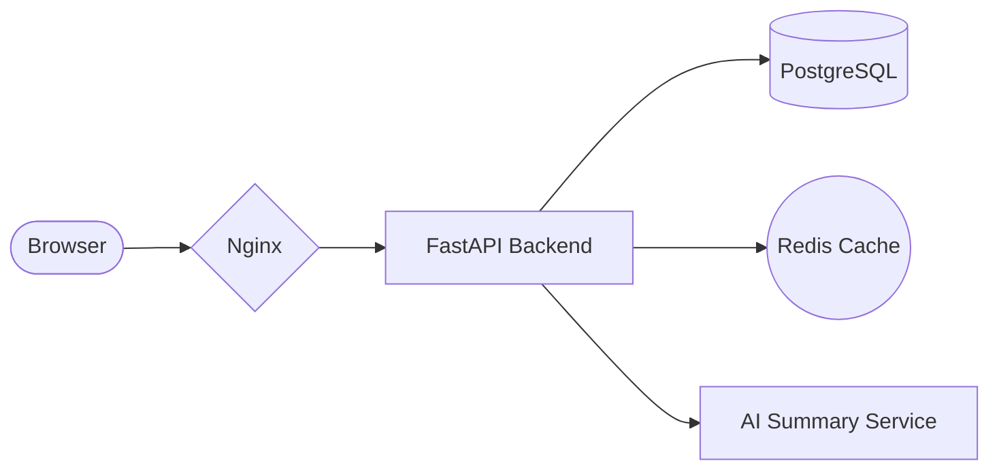

# ArchAgent

**Describe your idea. Get a complete project architecture.**

ArchAgent is a local AI tool that takes a plain-English description of your project idea and generates everything you need to start building — architecture diagrams, tech stack recommendations, milestone roadmaps, folder structures, and a full written plan.

No API keys. No internet. Runs entirely on your machine.

---

## What It Generates

For every idea you submit, ArchAgent produces:

| Output | Format | Description |
|---|---|---|
| Architecture Diagram | `.mmd` (Mermaid) | Visual map of all system components and how they connect |
| Written Plan | `.md` | Full stakeholder-ready planning document |
| Tech Stack | `.json` + table | Opinionated technology choices with categories |
| Folder Structure | `.json` + tree | Complete directory layout for the project |
| Milestone Roadmap | `.json` | Phased development plan with tasks and deliverables |
| Execution Flow | `.json` | Step-by-step breakdown of how the system runs |
| Full Report | `.md` | Single file combining all of the above |

Everything gets saved to an `outputs/` folder with a timestamped subdirectory per run.

---

## Example

**Input:**
```
A SaaS platform where small teams can track and manage their daily standups,
assign action items, and get AI-generated weekly summaries.
```

**Output:**
```
outputs/standup_tracker_20250308_142301/
├── plan.json
├── PLAN.md
├── architecture.mmd
├── folder_structure.json
├── milestones.json
├── tech_stack.json
└── FULL_REPORT.md
```

The architecture diagram renders directly on GitHub:



---

## How It Works

ArchAgent runs a 6-stage pipeline locally:

```
Your Prompt
    │
    ▼
1. Input Parser      — cleans and structures your idea
    │
    ▼
2. LLM Client        — talks to Ollama running on your machine
    │
    ▼
3. Planner           — generates the full structured plan via Qwen2.5
    │
    ▼
4. Formatter         — converts plan into diagrams, markdown, trees
    │
    ▼
5. Validator         — checks everything is complete and well-formed
    │
    ▼
6. Exporter          — saves all files to outputs/
```

---

## Requirements

### System

| Requirement | Version | Notes |
|---|---|---|
| Python | 3.11 or higher | Core language |
| Node.js | 18 or higher | Web UI only |
| Ollama | Latest | Runs the AI model locally |
| RAM | 8GB minimum | 16GB recommended for Qwen2.5-7B |
| Disk | ~5GB free | For the model weights |

### AI Model

| Model | Size | Download |
|---|---|---|
| `qwen2.5:7b` | ~4.7 GB | `ollama pull qwen2.5:7b` |

Qwen2.5-7B is the recommended model. It handles structured JSON generation and long-form writing well at 7B parameters. You can swap it for any other Ollama-compatible model in the config.

---

## Installation

### 1. Install Ollama

Go to [ollama.com](https://ollama.com) and download for your OS, or run:

```bash
# macOS / Linux
curl -fsSL https://ollama.com/install.sh | sh
```

### 2. Pull the Model

```bash
ollama pull qwen2.5:7b
```

This downloads ~4.7GB. Only needed once.

### 3. Clone the Repo

```bash
git clone https://github.com/yourusername/ArchAgent.git
cd ArchAgent
```

### 4. Set Up Python Environment

```bash
python -m venv .venv

# macOS / Linux
source .venv/bin/activate

# Windows
.venv\Scripts\activate
```

### 5. Install Python Dependencies

```bash
pip install -r requirements.txt
```

### 6. Install Frontend Dependencies (Web UI only)

```bash
cd web
npm install
cd ..
```

---

## Usage

### Option 1 — Web UI (Recommended)

Start both servers:

```bash
# Terminal 1 — Python API
uvicorn api.server:app --reload --port 8000

# Terminal 2 — React frontend
cd web && npm run dev
```

Open **http://localhost:5173** in your browser.

---

### Option 2 — CLI

```bash
# Interactive — prompts you for input
python -m cli.main

# Pass your idea directly
python -m cli.main "A mobile app for tracking personal finances with AI insights"

# With a project name and output directory
python -m cli.main --name "FinanceAI" --output-dir ./my-outputs "A mobile app for tracking personal finances"

# Verbose mode (shows pipeline stage details)
python -m cli.main --verbose "A real-time multiplayer chess platform"
```

---

### Option 3 — REST API

```bash
# Start the API server
uvicorn api.server:app --reload --port 8000
```

**Submit an idea:**
```bash
curl -X POST http://localhost:8000/generate \
  -H "Content-Type: application/json" \
  -d '{
    "prompt": "A platform for freelancers to manage clients, invoices, and contracts",
    "project_name": "FreelanceOS"
  }'
```

**Response:**
```json
{ "job_id": "f3a2b1c4-...", "status": "queued" }
```

**Poll for result:**
```bash
curl http://localhost:8000/result/f3a2b1c4-...
```

**Full API docs:** http://localhost:8000/docs

---
## Configuration

All settings are in `shared/config.py` and can be overridden with environment variables:

| Environment Variable | Default | Description |
|---|---|---|
| `ARCHAGENT_MODEL` | `qwen2.5:7b` | Ollama model name |
| `ARCHAGENT_OLLAMA_URL` | `http://localhost:11434` | Ollama server URL |
| `ARCHAGENT_OUTPUT_DIR` | `./outputs` | Where to save generated files |
| `ARCHAGENT_MAX_RETRIES` | `3` | Max LLM retry attempts |
| `ARCHAGENT_VERBOSE` | `false` | Show detailed pipeline logs |

Example — use a different model:
```bash
ARCHAGENT_MODEL=llama3.1:8b python -m cli.main "My project idea"
```

---

## Running Tests

```bash
# All tests (no Ollama needed — LLM calls are mocked)
pytest tests/ -v

# With coverage
pytest tests/ --cov=. --cov-report=term-missing
```

---
## License
